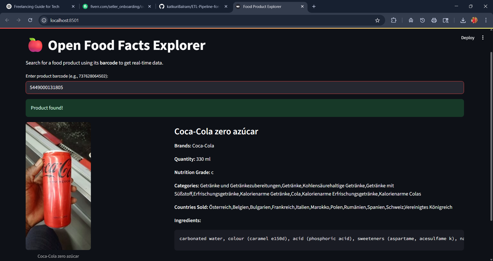

# 🧪 Food Product ETL & Dashboard using Open Food Facts API

This project demonstrates a complete **ETL (Extract, Transform, Load)** pipeline using real-time data from the **Open Food Facts API**. It also features a **Streamlit dashboard** to explore food product details interactively.

---

## 🚀 Project Highlights

- 🔗 Extract data using product barcodes from the Open Food Facts API
- 🔍 Transform JSON data into a structured, clean DataFrame
- 🗃️ Load data into a local SQLite database
- 📊 Streamlit dashboard to search & explore live product info
- 📷 Displays images, ingredients, brands, nutrition grades, and more

---

## 📁 Project Structure

```bash
├── food_etl.py              # Python script to run ETL pipeline
├── food_dashboard.py        # Streamlit dashboard application
├── openfoodfacts_products.db # SQLite database generated after ETL
└── README.md                # This file
```

---

## 📦 Tech Stack

- Python
- Pandas
- Requests
- SQLite
- Streamlit

---

## 📥 How to Use

### 1. Clone the repo
```bash
git clone https://github.com/your-username/food-etl-dashboard.git
cd food-etl-dashboard
```

### 2. Install dependencies

### 3. Run ETL Script
```bash
python food_etl.py
```

### 4. Launch Streamlit Dashboard
```bash
streamlit run food_dashboard.py
```

---

## 🔢 Sample Barcodes for Testing

| Product              | Barcode         |
|----------------------|-----------------|
| Pepsi                | `737628064502`  |
| Nutella              | `3017620422003` |
| Coca-Cola Zero       | `5449000131805` |
| Oreo                 | `7622210449283` |
| Red Bull             | `9002490100012` |

---

## 📷 Sample Dashboard Screenshot



---

## 🧠 What I Learned

- API data extraction & error handling
- Data cleaning & transformation using Pandas
- SQLite database integration
- Streamlit app development
- End-to-end data pipeline implementation

---

## 📌 Future Improvements

- Add barcode dropdown or filters by brand/category
- Visualize nutritional info with charts
- Add search history and caching

---

## 👤 Author

**Katkuri Balram**  
📫 [LinkedIn](www.linkedin.com/in/katkuri-balram-143284248) | 📂 [Portfolio](https://katkuribalram.github.io/portfolio/) | 💻 [GitHub](https://github.com/KatkuriBalram)

---

## 📄 License

This project is open-source and available under the [MIT License](LICENSE).
